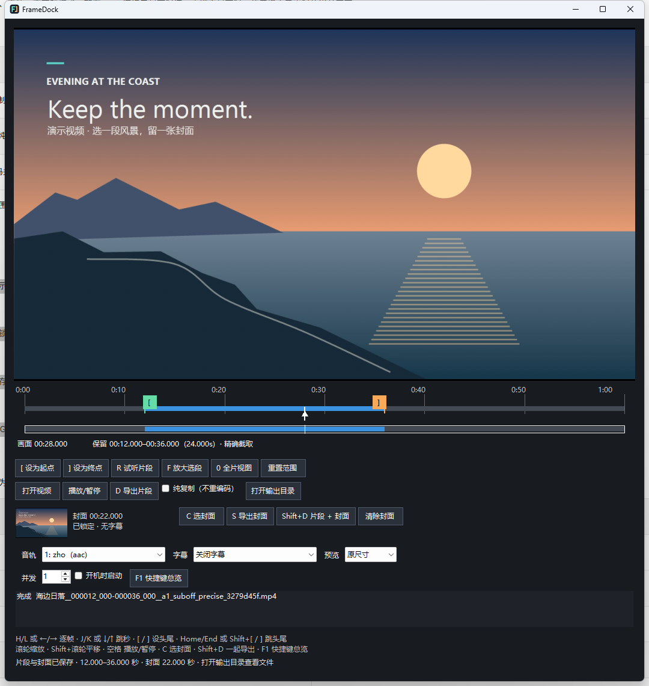

  

# FrameDock

**常驻托盘，按画面或节拍裁剪视频与音频，循环试听选区。**

- **闲置占用低：** 关闭窗口缩回托盘，退出预览播放器、停止扫描，释放视频缓存。再次打开恢复视频和编辑位置。
- **选段很顺手：** 拖入视频，逐帧定位，用 `[` / `]` 掐头去尾。
- **封面一起导出：** `C` 锁定画面，`Shift+D` 导出片段与原分辨率 PNG；继续调整片段也不会改变已选封面。

**[下载 v1.2.1 · Windows x64](https://github.com/hatrd/FrameDock/releases/tag/v1.2.1)**

## 看一眼就会用

| ① 选片段 | ② 选封面 | ③ 一起导出 |
| --- | --- | --- |
| 拖入 MKV / MP4，用 `[` / `]` 设置首尾 | 找到合适的画面，按 `C` 锁定 | 按 `Shift+D`，视频和 PNG 保存在源视频目录 |

使用“顺时针 90°”和“逆时针 90°”旋转画面。90° 或 270° 旋转会交换宽高，例如 1920×1080 → 1080×1920。预览、新截图及导出视频使用当前方向；旋转导出自动重新编码。已锁定封面保持选取时的方向，打开新视频重置旋转。

绿色 `[` 和橙色 `]` 表示截取范围，白色指针表示当前画面。截图中封面锁定在第 22 秒，播放指针已移到第 28 秒，封面仍保持不变。

空格播放／暂停，`←` / `→` 逐帧，`R` 试听选段，`S` 只导出封面。按 `F1` 查看全部快捷键。

点击「选区循环」切换循环模式，保留播放／暂停状态。空格从当前指针播放，到选区终点回到起点；指针在选区外时，继续播放会先回到起点。拖动指针或逐帧定位会暂停，但保留循环模式，空格可从选区中间继续。修改边界直接更新循环范围，暂停时保留当前位置，播放时仅在位置超出新范围时回到起点。`R` 始终从选区起点试听。循环直接播放源媒体，无需预先转换或缓存整个选区，没有 10 分钟限制；边界回跳可能有短暂间隙。

可直接打开 WAV、MP3、FLAC、OGG、Opus、M4A 等独立音频。开启「显示波形」查看音量起伏，滚轮放大后调整边界。「侦测 BPM」按需估计速度与节拍偏移；检测结果可手动输入、÷2 / ×2 校正，用「此处为节拍」指定网格起点。勾选「节拍吸附」后，拖动边界、播放指针和 `[` / `]` 会对齐节拍，选区读数同时显示拍数。变速音乐或弱节拍素材建议手动校正。

纯音频用 `D` / `Shift+D` 导出 48kHz、24bit WAV，按采样精确裁剪，避免有损编码填充影响循环。WAV 导出自动对首尾各淡化 2ms，选区长度保持不变，试听保持源音频。淡化消除波形接缝跳变，乐句衔接仍取决于所选边界。纯音频 `←` / `→` 每次移动 10ms。

默认“纯复制”速度快、保留源编码，但可能多留一段开头。**需要准确按所选起点截取时，取消勾选“纯复制”。**

录音音量偏小时，点击“响度标准化”按钮：导出会先测量所选音轨和片段，以固定增益向 −14 LUFS 调整，保留原有动态，不压缩或削平峰值。峰值受限时会降低增益，因此成品可能低于 −14 LUFS；处理时限制为 −2 dBTP，为 AAC 编码后的峰值留出余量。−14 LUFS 是网络视频的通用目标，并非各平台的固定官方标准。开启后自动使用精确模式，视频音频编码为 48kHz、320kbps AAC，纯音频仍导出 24bit WAV；预览保持原音。按钮开关会记住上次设置，重启或换视频后继续生效，无音频时跳过响度处理。

## 下载后怎么运行

1. 下载发布页中的 `FrameDock-v1.2.1-win-x64.zip`，解压并保留包内全部文件。
2. 安装 [.NET 8 桌面运行时](https://dotnet.microsoft.com/download/dotnet/8.0)（Windows x64 Desktop Runtime）。
3. 双击 `FrameDock.exe`，拖入视频。缺少 FFmpeg 时，程序会通过 WinGet 安装。

导出可在后台继续，关闭窗口也不会中断；有导出任务时仍会按需占用资源。双击托盘图标重新打开，右键菜单可退出。
